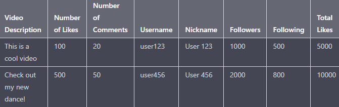

# TikTok Scraper

This Python script uses Selenium to scrape data from TikTok videos and saves the data to a CSV file.

## Setup

1. Install Python 3.
2. Install the required packages by running `pip install selenium pandas`.
3. Download and install the appropriate version of the ChromeDriver for your Chrome browser: https://sites.google.com/a/chromium.org/chromedriver/downloads
4. Update the `driver_path` variable in the script to point to the location of the ChromeDriver on your system.

## Usage

1. Run the script by running `python tiktok_scraper.py` in the terminal.
2. Enter a search query when prompted.
3. The script will scrape the data for all the search results and save it to a CSV file named `tiktok_data.csv`.

## Data Scraped

The following data is scraped from each TikTok video:
- Video description
- Number of likes
- Number of comments
- User profile information (username, nickname, followers, following, likes)

## Example Output

## Disclaimer

This script is intended for educational purposes only. Use of this script may violate TikTok's terms of service. Use at your own risk.
